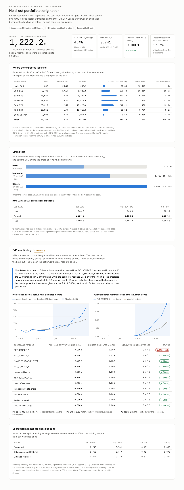
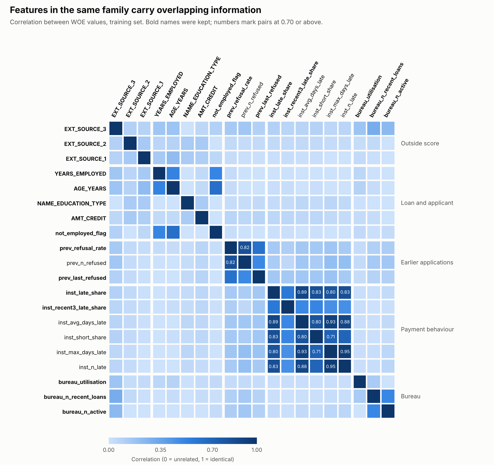

# Credit Risk Scorecard and Portfolio Monitoring

An end-to-end credit risk project on the public **Home Credit Default Risk** data (Kaggle, 307,511 applicants):
SQL feature engineering, a WOE/IV logistic-regression scorecard, a gradient-boosting benchmark, a 12-month expected-loss
view with stress tests, and PSI drift monitoring with a dashboard.



## Results (30% random hold-out, 92,254 applicants)

| Model | AUC | Gini | KS |
|---|---|---|---|
| Scorecard (11 features) | 0.741 | 0.481 | 0.359 |
| Gradient boosting, same features | 0.747 | 0.494 | 0.370 |
| Gradient boosting, all features | 0.762 | 0.523 | 0.394 |

- The scorecard is calibrated (8.10% predicted vs 8.07% actual default rate) and the default rate falls in every score band.
- Boosting gains +0.021 AUC, but only +0.006 comes from the model type; the rest comes from extra inputs. The scorecard stays as the explainable model.
- Base 12-month expected loss is 2.22% of exposure. Moderate and severe stress scenarios raise it by about 46% and 109%.

## How it works

| Step | What | Where |
|---|---|---|
| 1 | Load the four Kaggle tables into DuckDB | `load_real_data.py` |
| 2 | SQL features with CTEs and window functions (bureau, previous applications, payment behaviour), leakage-safe filters, placeholder and missing-value rules | `sql/`, `build_features.py` |
| 3 | Random stratified 70/30 split, WOE binning and IV, feature screening (IV, correlation, VIF), logistic regression, points scaling (600 points at 50:1 odds, 20 points double the odds), AUC/Gini/KS and band tables | `scorecard/01` to `06` |
| 4 | Gradient-boosting benchmark | `scorecard/07_gradient_boosting.py` |
| 5 | 12-month expected loss = PD x LGD x EAD, LGD and CCF sensitivity, stress scenarios | `scorecard/08_expected_loss.py` |
| 6 | PSI monitoring, Power BI-ready tables, HTML dashboard | `scorecard/09_psi_monitoring.py`, `dashboard/` |



## Run it

1. Download the four files from the Kaggle competition [Home Credit Default Risk](https://www.kaggle.com/competitions/home-credit-default-risk/data)
   (accept the competition rules first) and put them in `data/`:
   `application_train.csv`, `bureau.csv`, `previous_application.csv`, `installments_payments.csv`.
2. `pip install -r requirements.txt`
3. Run in order from the project folder:

```
python load_real_data.py
python build_features.py
python scorecard/01_split.py
python scorecard/02_fit_bins.py
python scorecard/03_select_features.py
python scorecard/04_fit_model.py
python scorecard/05_points.py
python scorecard/06_evaluate.py
python scorecard/07_gradient_boosting.py      # about 10 minutes
python scorecard/08_expected_loss.py
python scorecard/09_psi_monitoring.py
python dashboard/build_powerbi.py
python dashboard/build_dashboard.py           # writes dashboard/dashboard.html
```

Aggregate outputs are in `scorecard/output/` (WOE tables, IV ranking, points table, band tables, metrics). Loan-level files are
not committed; the scripts recreate them. `powerbi/` holds import-ready tables and `powerbi/README.txt` lists the relationships and DAX measures.

## Limitations (please read)

- **No application date in the data.** The split is random, not out-of-time, and loans are viewed at origination.
- **Drift monitoring is simulated.** The monthly PSI charts use twelve simulated cohorts drawn from the hold-out, tilted toward low `EXT_SOURCE_2`
  values with extra defaults added late. The real check (hold-out vs training) gives a score PSI of 0.0001.
- **LGD, interest rate, CCF, drawn share and the stress scenarios are assumptions.** The data has no recoveries or balances.
- **The 12-month PD** is a constant-hazard conversion of a lifetime "payment difficulties" flag.
- **Education is a model input** (9% of the scorecard's movement). A real lender would review it with compliance. Age was removed by the p-value rule.
- Whole-number points differ from the exact score by up to 4.1 points.
- This is a learning and portfolio project, not a lending model.

## Data

The Kaggle data is not included and must not be republished (competition rules apply). `data/` and the DuckDB file are git-ignored.
